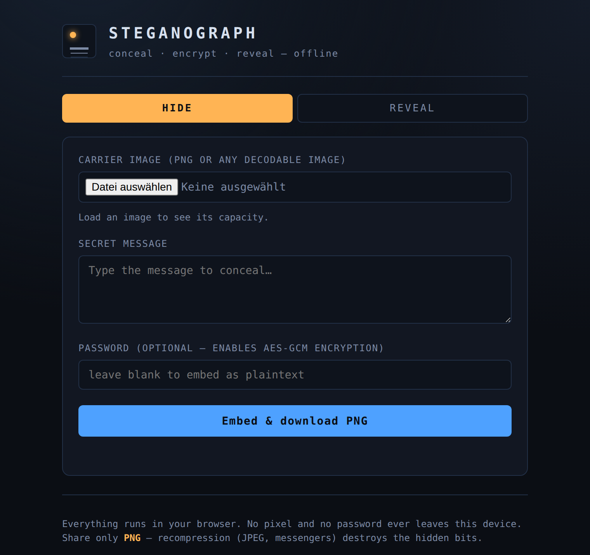

# Steganograph

[](LICENSE)
[](#install-on-android-as-an-app)
[](#security-model)

An installable, **fully-offline** PWA that hides a text message inside a PNG
image using LSB steganography — optionally AES-GCM encrypted with a password.
Nothing ever leaves your device.

<p align="center">
  
</p>

## Quick start

Toolchain is [Bun](https://bun.sh) (the environment has no Node).

```bash
bun install
bun run test      # engine proof — 12/12 headless tests
bun run typecheck # tsc --noEmit
bun run dev       # http://localhost:5173
bun run build     # production build: service worker + manifest + precache
```

## Install on Android (as an app)

The production build (`bun run build` → `dist/`) is an installable PWA:
service-worker precache, web-app manifest, and 192/512 + maskable icons. Once
installed it runs **full-screen and fully offline**, like a native app — no
store, no APK.

1. **Build:** `bun run build` → static files land in `dist/`.
2. **Host `dist/` on HTTPS with a *trusted* certificate.** This is the one hard
   requirement — Chrome only offers install on a secure, trusted origin. Easiest
   options: GitHub Pages, Netlify (drag-and-drop the folder), Vercel, or
   Cloudflare Pages. A **self-signed LAN dev cert will NOT allow install**
   (`localhost` is fine for testing, but not reachable from the phone).
3. **On the phone:** open the URL in Chrome → tap the in-app **“Install app”**
   button (or ⋮ menu → *Install app* / *Add to Home screen*).
4. It installs to the home screen and works offline from then on.

> Native wrapping (Capacitor → real `.apk`) is possible later but needs a JDK +
> Android SDK; the installable PWA above needs none of that.

## How it works

Three **DOM-free** engine modules under `src/engine/` — they touch no browser
API beyond the `ImageData` *shape*, which is exactly why the whole engine is
headless-testable:

- **`crypto.ts`** — PBKDF2-SHA-256 (250 000 iterations) derives an AES-GCM
  256-bit key from your password. Blob layout: `salt(16) ‖ iv(12) ‖ ciphertext(+tag)`.
- **`stego.ts`** — embeds payload bits in the least-significant bit of the R, G
  and B channels via canvas `ImageData`. Every pixel is forced **opaque**
  (alpha = 255) so premultiplied-alpha rounding can't flip color LSBs on
  re-encode.
- **`codec.ts`** — frames the payload with a header
  (`MAGIC ‖ version ‖ flags ‖ length`) and clamps crypto + stego together.

The UI shell (`src/ui.ts`, `src/main.ts`) only shuttles pixels between file
inputs, a `<canvas>` and the codec.

## Security model

- **Confidentiality** comes from AES-GCM, not from hiding. Treat the plaintext
  mode as obfuscation only — anyone who suspects a stego payload can read it.
- GCM is authenticated: a wrong password (or any tampering) makes reveal
  **fail loudly** rather than return garbage.
- **Keys never leave the browser.** No network, no telemetry, no web fonts —
  which is what makes "offline" honest.
- LSB is **not robust to recompression.** Share the output **only as PNG**.
  JPEG, screenshots, and most messengers re-encode images and will destroy the
  hidden bits. This is a limitation of v1, not a bug.

## Roadmap

- **DCT-domain embedding** for robustness against recompression — the real
  unlock for sharing over messengers; plain LSB cannot survive that.
- **Seed-based bit-scattering** — spread payload bits pseudo-randomly from a
  seed to blur the flat LSB steganalysis signature.

## Layout

```
src/engine/{crypto,stego,codec}.ts   DOM-free engine (the proven core)
src/{ui,main}.ts, src/styles.css     PWA shell
test/engine.test.ts                  headless roundtrip / tamper / capacity / LSB tests
vite.config.ts                       vite-plugin-pwa (autoUpdate, Workbox precache)
public/icon-{192,512}.png            app icons
```
