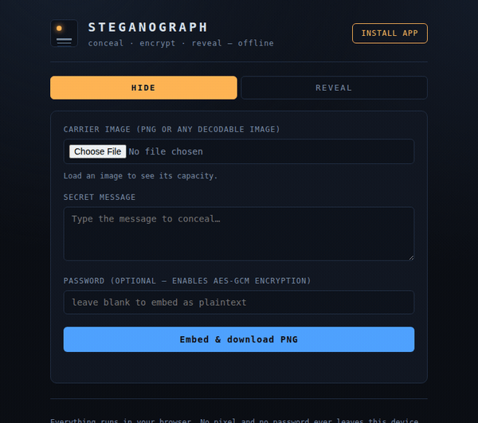

# Steganograph

[](https://github.com/bwboesch/Steganograph/actions/workflows/build.yml)
[](LICENSE)
[](#install-on-android-as-an-app)
[](#security-model)

An installable, **fully-offline** PWA that hides a text message inside a PNG
image using LSB steganography — optionally AES-GCM encrypted with a password.
Nothing ever leaves your device.

**▶ Live demo: <https://bwboesch.github.io/Steganograph/>** — open on Android
Chrome and tap **Install app** to add it to your home screen.

<p align="center">
  <br>
  <em>A full encrypt → embed → reveal roundtrip — recorded from the live app.</em>
</p>

<p align="center">
  
</p>

## Quick start

Toolchain is [Bun](https://bun.sh) (the environment has no Node).

```bash
bun install
bun run test      # engine proof — 25/25 headless tests
bun run typecheck # tsc --noEmit
bun run dev       # http://localhost:5173
bun run build     # production build: service worker + manifest + precache
```

## Install on Android (as an app)

The production build (`bun run build` → `dist/`) is an installable PWA:
service-worker precache, web-app manifest, and 192/512 + maskable icons. Once
installed it runs **full-screen and fully offline**, like a native app — no
store, no APK.

1. **Build:** `bun run build` → static files land in `dist/`.
2. **Host `dist/` on HTTPS with a *trusted* certificate.** This is the one hard
   requirement — Chrome only offers install on a secure, trusted origin. Easiest
   options: GitHub Pages, Netlify (drag-and-drop the folder), Vercel, or
   Cloudflare Pages. A **self-signed LAN dev cert will NOT allow install**
   (`localhost` is fine for testing, but not reachable from the phone).
3. **On the phone:** open the URL in Chrome → tap the in-app **“Install app”**
   button (or ⋮ menu → *Install app* / *Add to Home screen*).
4. It installs to the home screen and works offline from then on.

> Native wrapping (Capacitor → real `.apk`) is possible later but needs a JDK +
> Android SDK; the installable PWA above needs none of that.

## How it works

The app has **two embedding modes**, both **DOM-free** under `src/engine/` —
they touch no browser API beyond the `ImageData` *shape*, which is exactly why
the whole engine is headless-testable:

- **Lossless (PNG)** — LSB embedding. Maximum capacity, byte-exact. Any
  re-encode destroys it, so the PNG must be shared unchanged.
- **Robust (JPEG)** — DCT/QIM embedding. Survives JPEG re-encoding (email,
  Telegram "send as file", Signal original, cloud links) but **not resizing**.
  Lower capacity.

The modules:

- **`crypto.ts`** — PBKDF2-SHA-256 (250 000 iterations) derives an AES-GCM
  256-bit key from your password. Blob layout: `salt(16) ‖ iv(12) ‖ ciphertext(+tag)`.
- **`stego.ts`** — embeds payload bits in the least-significant bit of the R, G
  and B channels via canvas `ImageData`. Every pixel is forced **opaque**
  (alpha = 255) so premultiplied-alpha rounding can't flip color LSBs on
  re-encode.
- **`scatter.ts`** — spreads the payload pseudo-randomly across the image
  instead of front-to-back, via a keyed Feistel permutation of the bit-slots.
  This dissolves the sequential-fill boundary that classic LSB steganalysis
  keys on. The header rides a **public** permutation (so decode can still read
  the length + "is it encrypted?" without a password); the payload of an
  **encrypted** message rides a **password-keyed** permutation, so an attacker
  can't even locate the payload bits without the key.
- **`codec.ts`** — frames the payload with a header
  (`MAGIC ‖ version ‖ flags ‖ length`) and clamps crypto + stego + scatter
  together for the lossless mode.
- **`dct.ts`** — DCT/QIM primitive for the robust mode: quantization-index
  modulation on one mid-frequency coefficient of each 8×8 luminance block, one
  bit per block. The step Δ is the robustness knob (Δ=24 → 0 bit-errors down to
  JPEG Q60).
- **`robust.ts`** — the robust-mode codec: same header framing + AES-GCM, plus
  interleaved repetition ECC (R=5 header, R=3 body) over `dct.ts`. Exported as
  JPEG.

The UI shell (`src/ui.ts`, `src/main.ts`) only shuttles pixels between file
inputs, a `<canvas>` and the codec.

## Security model

- **Confidentiality** comes from AES-GCM, not from hiding. Treat the plaintext
  mode as obfuscation only — anyone who suspects a stego payload can read it.
- GCM is authenticated: a wrong password (or any tampering) makes reveal
  **fail loudly** rather than return garbage.
- **Keys never leave the browser.** No network, no telemetry, no web fonts —
  which is what makes "offline" honest.
- Scattering blurs the steganalysis *signature*; it does **not** add robustness
  to recompression. In **lossless (PNG)** mode, LSB (in any bit order) is
  destroyed by re-encoding, so share the PNG unchanged. Use **robust (JPEG)**
  mode when the image will be re-encoded — but note it does **not** survive
  resizing, so messengers that downscale (WhatsApp, Instagram) still wipe it.

## Roadmap

- ✅ **Seed-based bit-scattering** — *done* (`scatter.ts`). Payload bits are
  spread pseudo-randomly from a keyed seed, blurring the flat LSB steganalysis
  signature and hiding the payload's location for encrypted messages.
- ✅ **DCT-domain "Robust (JPEG)" mode** — *shipped* (`src/engine/dct.ts` +
  `robust.ts`). QIM on mid-frequency 8×8-block luma coefficients, with
  interleaved repetition ECC and JPEG export. Measured against a real JPEG
  compressor (`tools/dct-robustness/`):
  - **Survives pure re-encoding well**: 0 bit-errors down to JPEG Q60 (Δ≥20). A
    real-browser E2E confirms a full encrypt → embed → JPEG export → second JPEG
    re-encode → decrypt roundtrip.
  - **Does *not* survive downscaling**: resizing shifts the block grid — ~50%
    bit-errors at ×0.5, so anything that resizes (WhatsApp/Instagram) still
    wipes it. The UI labels this clearly. See
    [`tools/dct-robustness/FINDINGS.md`](tools/dct-robustness/FINDINGS.md).
- 🔭 **Resize-robust embedding** — beating downscaling needs a
  resync/resolution-independent scheme (sync templates, log-polar/Fourier marks,
  or feature-anchored blocks). A separate, larger research effort.

## Layout

```
src/engine/{crypto,stego,scatter,codec}.ts  lossless (PNG) LSB engine
src/engine/{dct,robust}.ts                  robust (JPEG) DCT/QIM engine
src/{ui,main}.ts, src/styles.css            PWA shell (two-mode UI)
test/engine.test.ts                         25 headless tests: roundtrip / tamper /
                                            capacity / LSB / scatter / dct / robust
tools/dct-robustness/                       JPEG-survival measurement harness + FINDINGS
vite.config.ts                              vite-plugin-pwa (autoUpdate, Workbox precache)
public/icon-{192,512}.png                   app icons
```
